#  AI Interview Simulator

> A placement-level AI-powered interview preparation platform that helps students practice interviews with real-time feedback, resume analysis, and performance analytics.

    

**Live Demo:** [https://my-project-a8cp792of-preethiragus-projects.vercel.app](https://my-project-a8cp792of-preethiragus-projects.vercel.app)

**Backend API:** [https://ai-interview-simulator-4-bgqw.onrender.com/docs](https://ai-interview-simulator-4-bgqw.onrender.com/docs)

---

## About

AI Interview Simulator is a full-stack SaaS-style web application built by **PreethiRaghu** for placement preparation. It simulates real interview experiences using AI, analyzes resumes, generates personalized questions, and provides detailed performance feedback — making it stand out as a startup-level project.

---

## Screenshots

### Landing Page
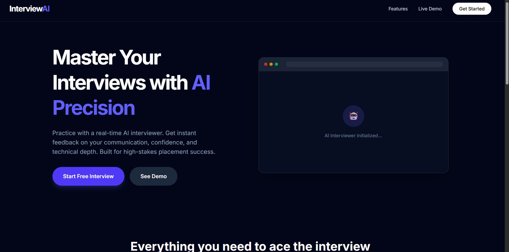
> Hero section with AI demo preview, CTA buttons, and modern dark SaaS design.

---

### Login Page
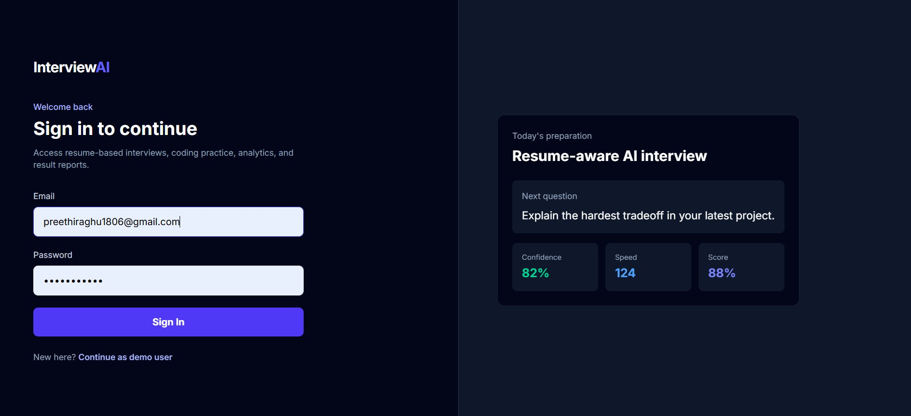
> Clean two-panel login with live interview stats preview on the right.

---

### Dashboard
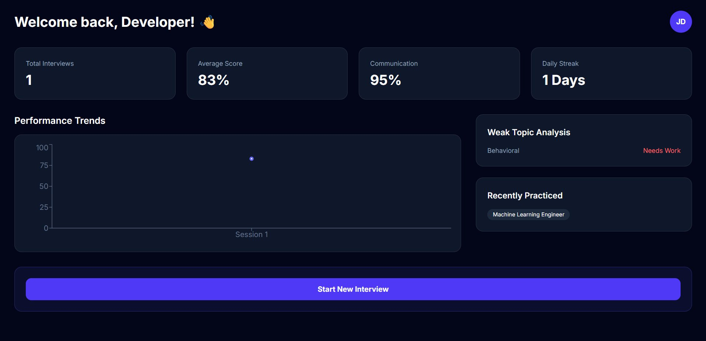
> Analytics dashboard showing total interviews, average score, communication score, daily streak, performance trends chart, weak topic analysis, and recently practiced roles.

---

### Domain Selection
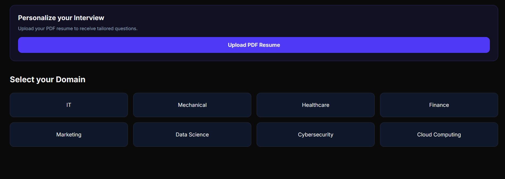
> Choose from 8+ domains: IT, Mechanical, Healthcare, Finance, Marketing, Data Science, Cybersecurity, Cloud Computing. Also supports PDF resume upload for personalized questions.

---

### Role Selection
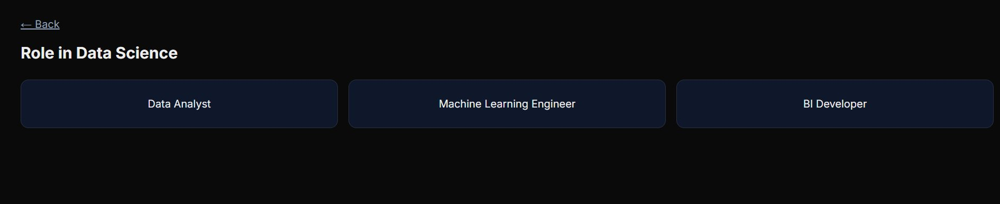
> Select a specific job role within the chosen domain (e.g., Data Analyst, Machine Learning Engineer, BI Developer).

---

### Interview Configuration
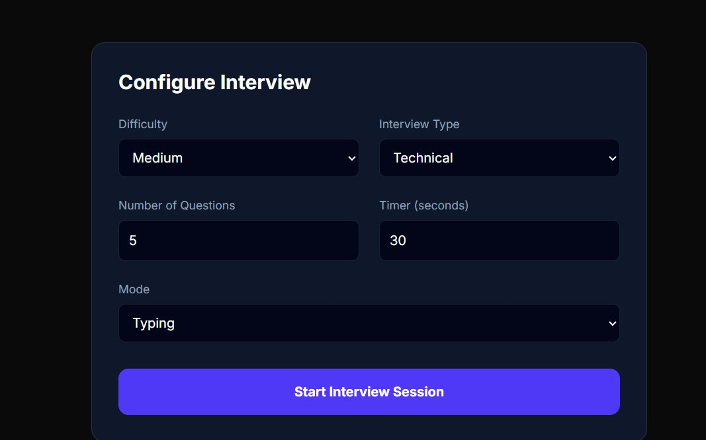
> Configure difficulty level, interview type (HR/Technical/Behavioral/Coding), number of questions, timer, and mode (Typing/Voice).

---

### AI Interview Interface
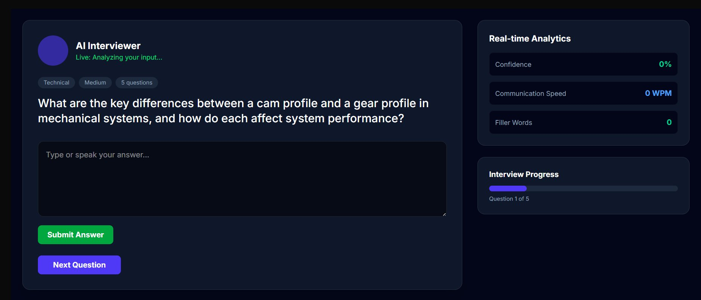
> Live interview screen with AI Interviewer avatar, question display, answer input, real-time analytics (Confidence, Communication Speed, Filler Words), and interview progress tracker.

---

### Interview Results
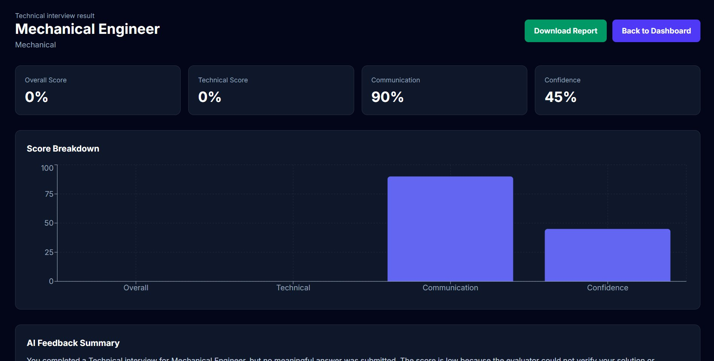
> Detailed result page with Overall Score, Technical Score, Communication, Confidence, Score Breakdown chart, and AI Feedback Summary.

---

### Question-by-Question Feedback
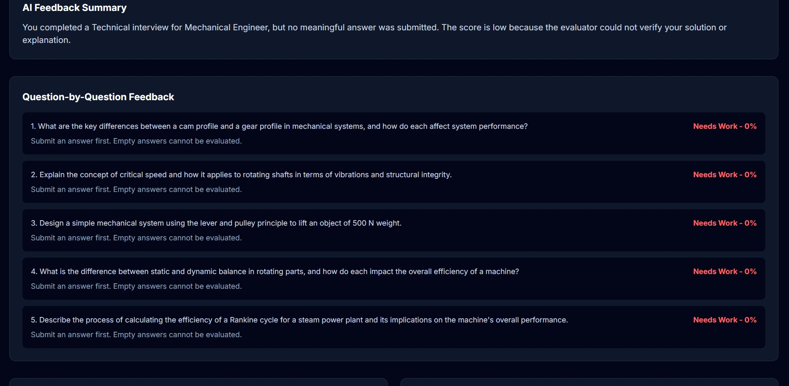
> Detailed per-question evaluation with individual scores and feedback for every answer submitted.

---

### Strengths, Weaknesses & Improvement Roadmap
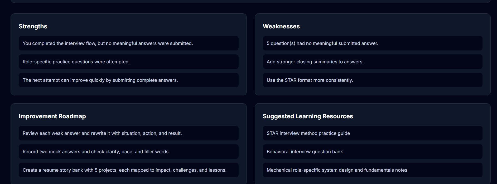
> AI-generated strengths, weaknesses, improvement roadmap, and suggested learning resources based on performance.

---

##  Features

### Core Features
- **AI-Powered Interview Questions** — Generated using Groq LLaMA 3.1 based on domain, role, difficulty, and type
- **Resume Upload & Analysis** — Upload PDF resume; AI extracts skills and generates personalized questions
- **Multiple Interview Types** — HR, Technical, Behavioral, and Coding rounds
- **Real-time Feedback** — Confidence score, communication score, and technical evaluation
- **Coding Round** — Online code editor with AI complexity analysis and hint generation

### Dashboard & Analytics
- Total interviews attended
- Average score tracking
- Communication score trends
- Daily streak monitoring
- Weak topic analysis
- Recently practiced roles
- Performance trend charts

### Domain Support
IT, Mechanical, Healthcare, Finance, Marketing, Data Science, Cybersecurity, Cloud Computing

### Job Role Support
Frontend Developer, Backend Developer, Java Developer, Data Analyst, HR Executive, Machine Learning Engineer, BI Developer, and more

---

## System Architecture

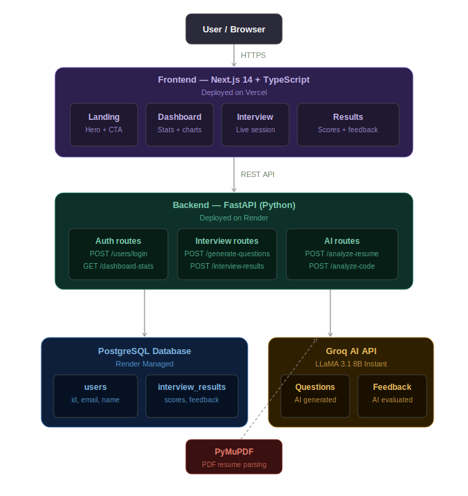

---

## Database Schema

### `users` table
| Column | Type | Description |
|---|---|---|
| id | TEXT (UUID) | Primary key |
| email | TEXT | Unique user email |
| name | TEXT | Display name |
| created_at | TEXT | ISO timestamp |
| updated_at | TEXT | ISO timestamp |

### `interview_results` table
| Column | Type | Description |
|---|---|---|
| id | TEXT (UUID) | Primary key |
| user_id | TEXT | Foreign key → users |
| score | INTEGER | Overall score (0-100) |
| technical_score | INTEGER | Technical score |
| communication_score | INTEGER | Communication score |
| confidence_score | INTEGER | Confidence score |
| domain | TEXT | e.g. IT, Mechanical |
| role | TEXT | e.g. Data Analyst |
| type | TEXT | HR / Technical / Behavioral / Coding |
| strengths | TEXT | JSON array |
| weaknesses | TEXT | JSON array |
| improvement_roadmap | TEXT | JSON array |
| feedback_summary | TEXT | AI-generated summary |
| resources | TEXT | JSON array |
| chart_data | TEXT | JSON array |
| question_feedback | TEXT | JSON array |
| created_at | TEXT | ISO timestamp |

---

##  User Flow

```
1. Landing Page
      │
      ▼
2. Login / Sign In
   (email saved to localStorage)
      │
      ▼
3. Dashboard
   (stats fetched from /dashboard-stats)
      │
      ▼
4. Click "Start New Interview"
      │
      ▼
5. Upload PDF Resume (optional)
   → /analyze-resume → AI extracts skills
      │
      ▼
6. Select Domain (IT / Mechanical / etc.)
      │
      ▼
7. Select Job Role
      │
      ▼
8. Configure Interview
   (difficulty, type, questions, timer, mode)
      │
      ▼
9. AI Interview Session
   → /generate-questions → LLaMA generates questions
   → User answers each question
   → Real-time confidence + WPM analysis
      │
      ▼
10. Submit Interview
    → /interview-results (POST) saves result
      │
      ▼
11. Results Page
    → /interview-results/latest (GET)
    → Shows scores, charts, feedback, roadmap
      │
      ▼
12. Back to Dashboard
    → Updated stats visible
```

---

## Tech Stack

| Layer | Technology |
|---|---|
| Frontend | Next.js 14, TypeScript, Tailwind CSS |
| Backend | FastAPI (Python) |
| AI Engine | Groq API (LLaMA 3.1 8B Instant) |
| Database | PostgreSQL (Render Managed) |
| PDF Processing | PyMuPDF (fitz) |
| Charts | Recharts |
| Deployment | Vercel (Frontend), Render (Backend) |

---

## Project Structure

```
ai-interview-simulator/
├── frontend/
│   ├── app/
│   │   ├── page.tsx              # Landing page
│   │   ├── login/page.tsx        # Login page
│   │   ├── dashboard/page.tsx    # Dashboard
│   │   ├── interview/
│   │   │   ├── page.tsx          # Domain + role selection
│   │   │   ├── config/page.tsx   # Interview configuration
│   │   │   ├── session/page.tsx  # Live interview
│   │   │   └── result/page.tsx   # Results page
│   │   └── layout.tsx
│   ├── components/               # Reusable UI components
│   ├── public/
│   └── .env.local
│
└── backend/
    └── app/
        ├── main.py               # FastAPI app + all routes
        └── requirements.txt      # Python dependencies
```

---

## API Endpoints

| Method | Endpoint | Description |
|---|---|---|
| GET | `/` | Health check |
| POST | `/users/login` | Login or create user |
| POST | `/generate-questions` | Generate AI interview questions |
| POST | `/analyze-resume` | Upload and analyze PDF resume |
| POST | `/interview-results` | Save interview result |
| GET | `/interview-results/latest` | Get latest result for user |
| GET | `/dashboard-stats` | Get user dashboard analytics |
| POST | `/analyze-code` | AI code review and complexity analysis |
| POST | `/run-code` | Execute user code |

---

## Getting Started

### Prerequisites
- Node.js 18+
- Python 3.10+
- Groq API Key ([get one free](https://console.groq.com))

### Frontend Setup

```bash
cd frontend
npm install
cp .env.local.example .env.local
# Add your backend URL to .env.local
npm run dev
```

### Backend Setup

```bash
cd backend/app
pip install -r requirements.txt
# Create .env file with your keys
uvicorn main:app --reload --port 8000
```

### Environment Variables

**Frontend `.env.local`:**
```env
NEXT_PUBLIC_API_URL=https://your-backend.onrender.com
NEXT_PUBLIC_API_BASE_URL=https://your-backend.onrender.com
```

**Backend `.env`:**
```env
GROQ_API_KEY=your_groq_api_key
DATABASE_URL=your_postgresql_url
```

---

## Backend Dependencies

```
fastapi
uvicorn
python-dotenv
groq
pymupdf
pydantic
python-multipart
psycopg2-binary
```

---

## Deployment

| Service | Platform | URL |
|---|---|---|
| Frontend | Vercel | [Live Link](https://my-project-a8cp792of-preethiragus-projects.vercel.app) |
| Backend | Render | [API Docs](https://ai-interview-simulator-4-bgqw.onrender.com/docs) |
| Database | PostgreSQL (Render) | — |

> **Note:** The backend is on Render's free tier and may take 30–60 seconds to wake up after inactivity.

---

## What Makes This Stand Out

- **Resume-aware AI questions** — Personalized questions based on your actual resume content
- **Multi-domain support** — 8+ domains with specific job roles
- **Real scoring system** — Technical, communication, and confidence scores with charts
- **Question-by-question feedback** — Detailed evaluation for every answer
- **Improvement roadmap** — AI-generated learning path based on weak areas
- **Suggested learning resources** — Curated resources per performance
- **Real-time analytics** — Confidence %, WPM, filler word detection during interview
- **SaaS-style UI** — Professional dark theme with modern card design

---

## Author

**PreethiRaghu**

Built as a placement-level project to demonstrate full-stack AI application development.

---

## 📄 License

This project is for educational and portfolio purposes.
